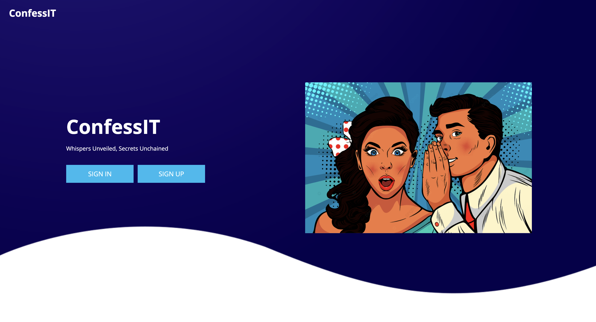
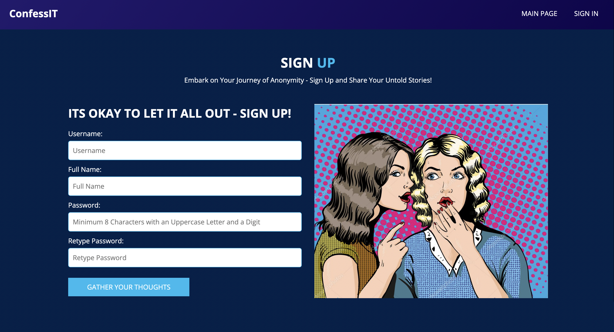
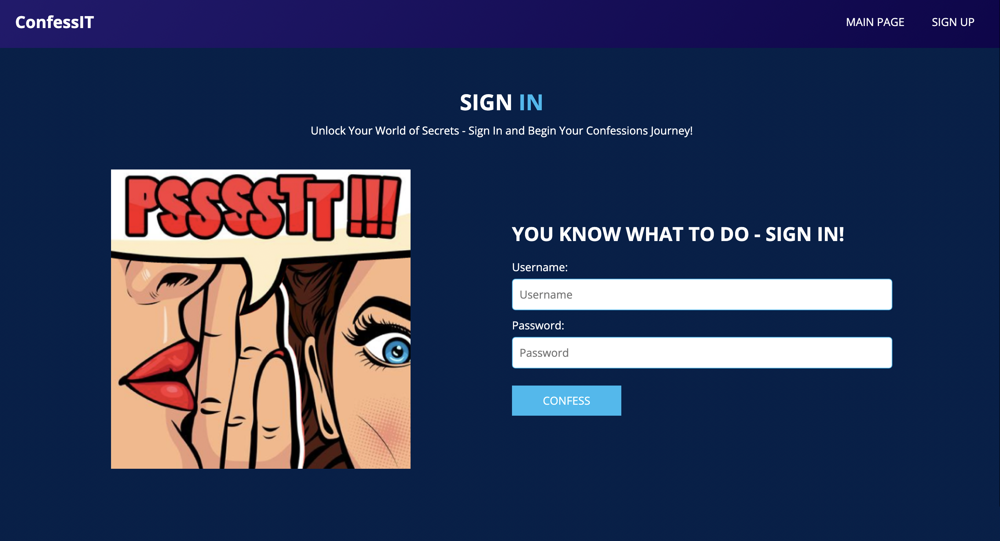
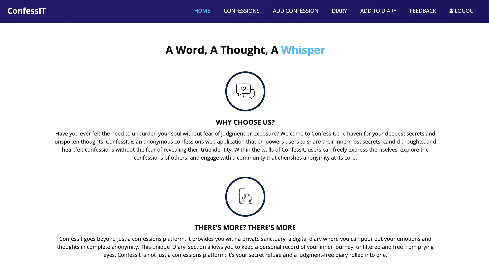
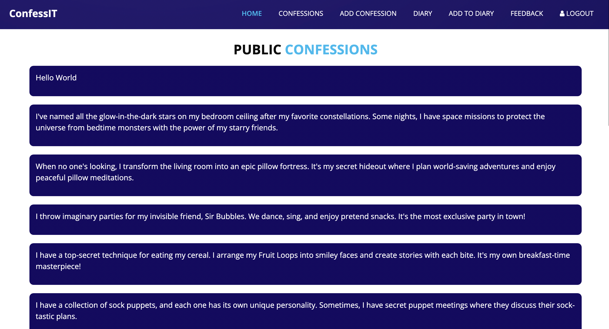
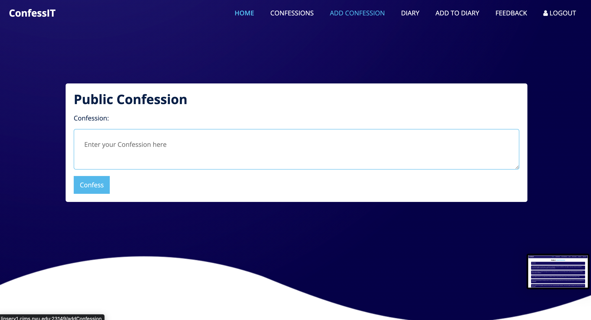
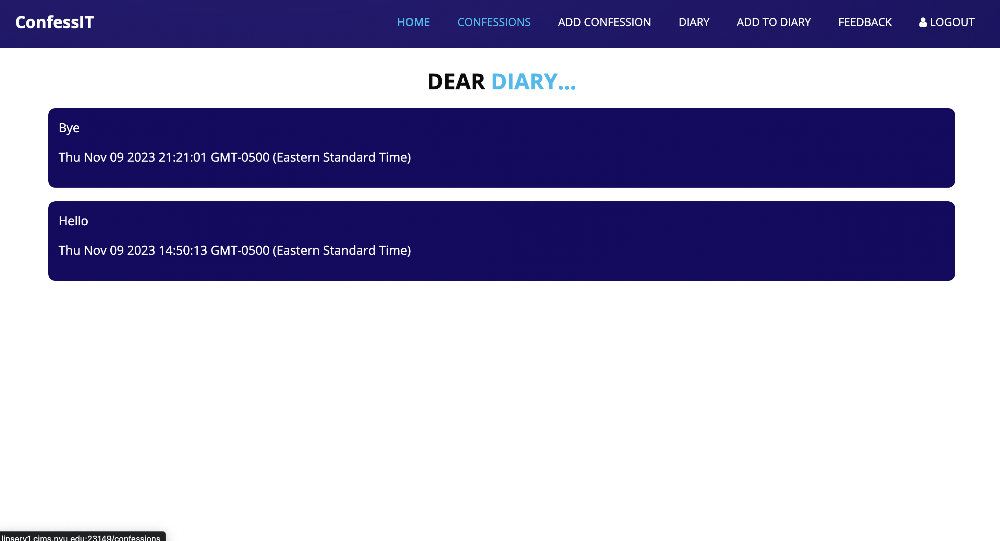
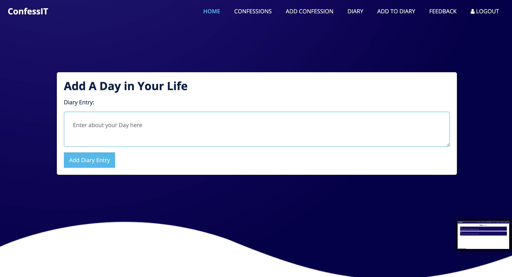
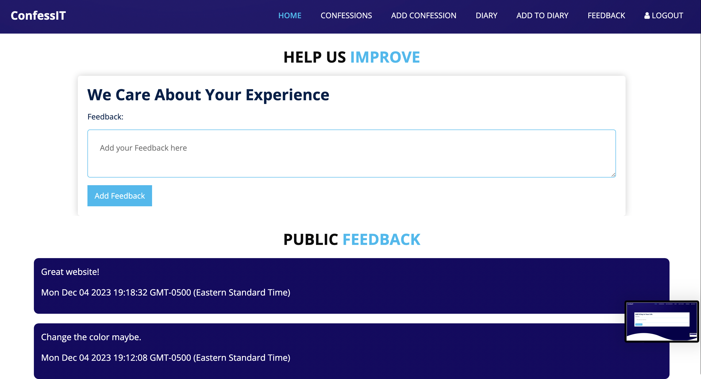

# ConfessIt - An Anonymous Confessions Platform
## Overview

Have you ever felt the need to unburden your soul without fear of judgment or exposure? Welcome to ConfessIt, the haven for your deepest secrets and unspoken thoughts. ConfessIt is an anonymous confessions web application that empowers users to share their innermost secrets, candid thoughts, and heartfelt confessions without the fear of revealing their true identity. Within the walls of ConfessIt, users can freely express themselves, explore the confessions of others, and engage with a community that cherishes anonymity at its core.

But ConfessIt goes beyond just a confessions platform. It provides you with a private sanctuary, a digital diary where you can pour out your emotions and thoughts in complete anonymity. This unique 'Diary' section allows you to keep a personal record of your inner journey, unfiltered and free from prying eyes. ConfessIt is not just a confessions platform; it's your secret refuge and a judgment-free diary rolled into one.
## Data Model

The ConfessIt application will have three main data entities: Users, Diaries, and Confessions, each with its own set of attributes.

1. Users:

Users are the individuals who create accounts and interact with the platform.
Each user has the following attributes:
* username: A unique username chosen by the user while signup.
* hash: A password hash to secure the user's account.
* diary: A reference to the user's personal diary document.
* confessions: An array of references to Confession documents posted by the user.

```javascript
{
  username: "abc123",
  hash: // a password hash,
  diary: // a reference to the user's Diary document,
  confessions: // an array of references to Confession documents
}
```

2. Diary:

The Diary entity represents the user's private space to record personal thoughts and reflections.
Each diary document includes:
* user: A reference to the User who owns the diary.
* entries: An array of diary entries, each containing a timestamp and the content of the entry.

```javascript
{
  user: // a reference to the User document,
  entries: [
    { content: "Today, I felt...", timestamp: /* timestamp */},
    { content: "A secret I've been carrying...", timestamp: /* timestamp */ },
  ]
}
```

3. Confessions:

Confessions represent the public, anonymous disclosures made by users.
Each confession includes:
* user: A reference to the User who posted the confession.
* content: The text content of the confession.
* likes: The number of users who liked the confession.
* dislikes: The number of users who disliked the confession.

```javascript
{
  user: // a reference to the User document,
  content: "I did something I'm not proud of...",
  timestamp: // timestamp,
}
```
## [Link to Commented First Draft Schema](db.mjs) 

## Wireframes
/ - main page when user is not logged in



/signup - page for when user is trying to sign up



/signin - page for when user is trying to sign in



/home - page for home when user is signed in



/confessions - page for all the public confessions



/addConfession - page for when user is trying to add a confessions



/diary - page for when user is trying to access their diary



/addToDiary - page for when user is trying to add another log to their diary



/feedback - page for when user is giving feedback



## User Stories or Use Cases

1. As an unregistered user, I can register for an account with a unique username and a secure password.
2. As a registered user, I can log in to my account.
3. As a user, I can submit a confession, including the content of my confession.
4. As a user, I can view confessions posted by others in the Confession Feed.
5. As a user, I can view the details of a confession, including its content, the number of likes, and dislikes.
6. As a user, I can add personal diary entries to my Diary.
7. As a user, I can view my personal diary entries in the Diary section.
8. As a user, I can maintain my anonymity while using the platform, ensuring my identity remains confidential.
9. As a user, I can provide feedback to the developers of the platform

## Research Topics

* Bootstrap for UI Styling
    * Bootstrap is a front-end framework for designing responsive and visually appealing user interfaces.
    * Integrating Bootstrap will enhance the UI styling of the application.
* Configuration Management with dotenv
    * dotenv is a Node.js module for managing environment variables and configuration settings.
    * It will help me simplify the management of environment-specific configuration settings.
* Automated Functional Testing
    * Selenium is a tools for automated functional testing.
    * It will help me automate functional testing which will ensure application functionality across different scenarios.
* Integrate user authentication
    * Passport.js is a popular authentication library for Node.js.
    * It provides a secure and flexible way to implement user authentication.

## Annotations / References Used

* Bootstrap - [https://getbootstrap.com/] - Reference for Bootstrap, a front-end framework for UI styling.
* dotenv - [https://www.npmjs.com/package/dotenv] - Reference for dotenv, the module used for configuration management.
* Selenium - [https://www.selenium.dev/] - Reference for Selenium, the automated functional testing tool.
* Passport.js - [https://www.passportjs.org/docs/] - Reference for Passport.js, the library used for user authentication in Node.js applications.